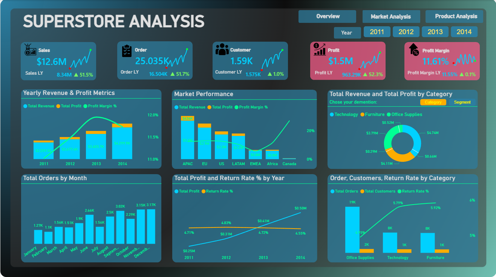
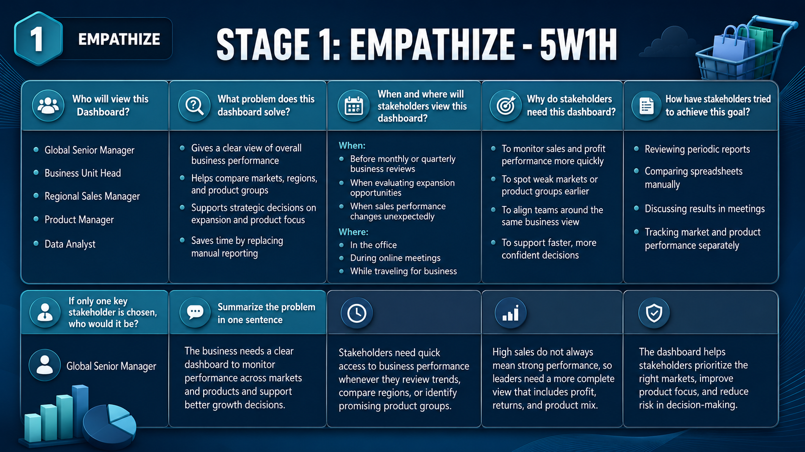
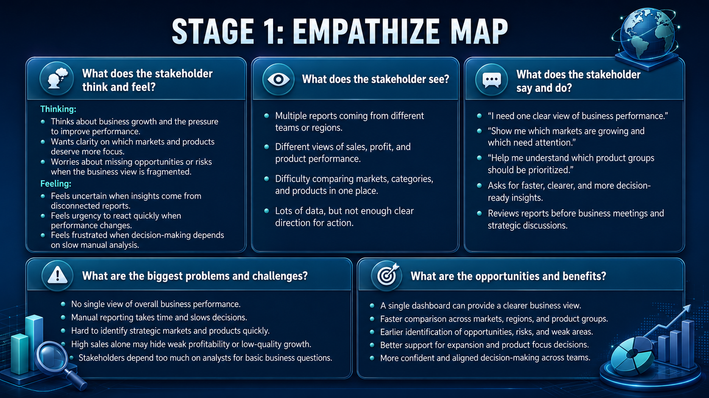
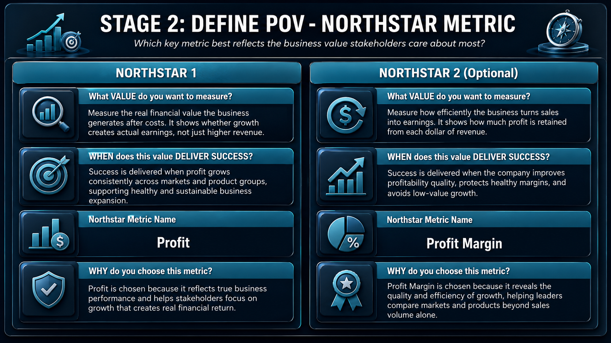
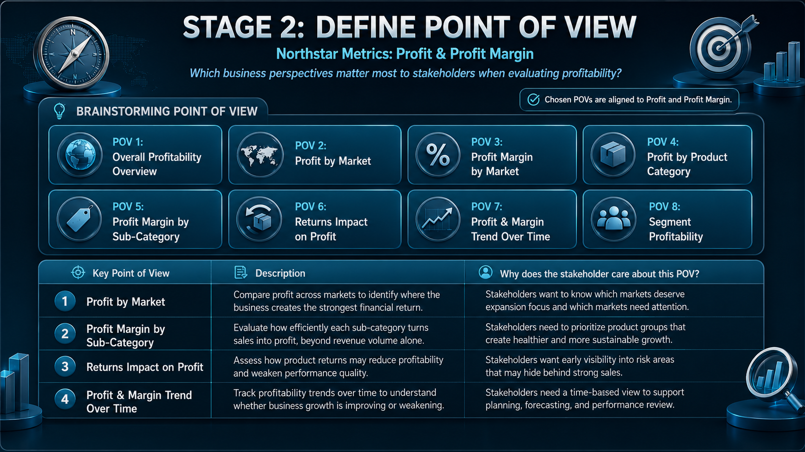
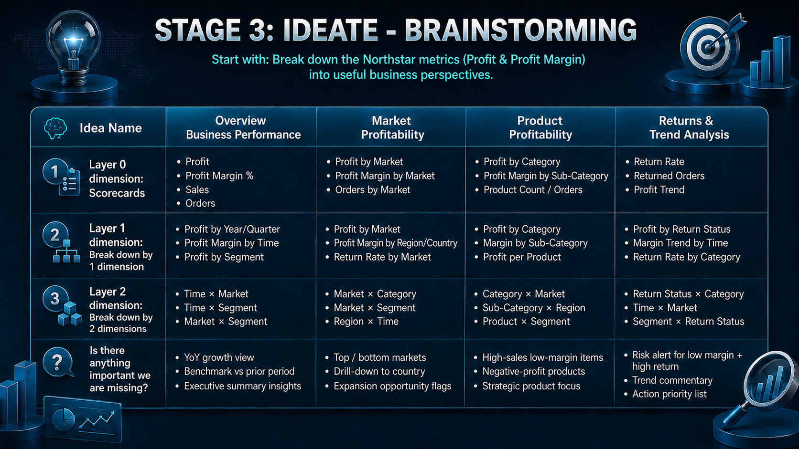
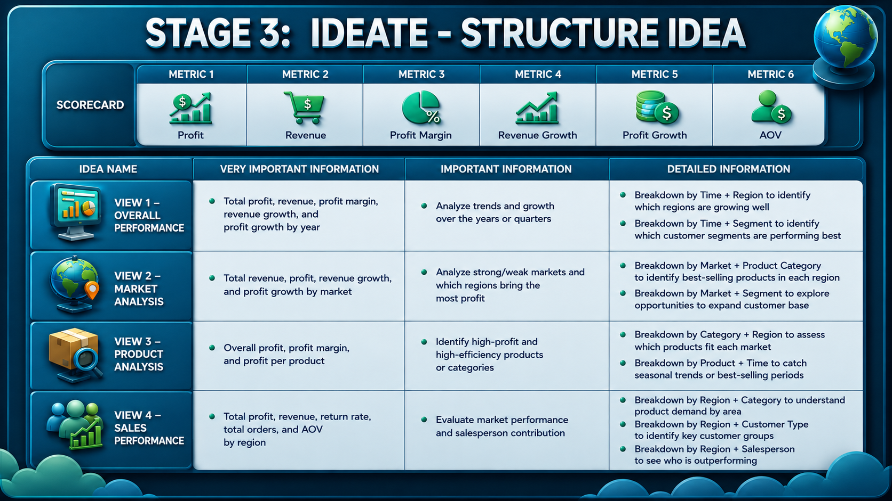
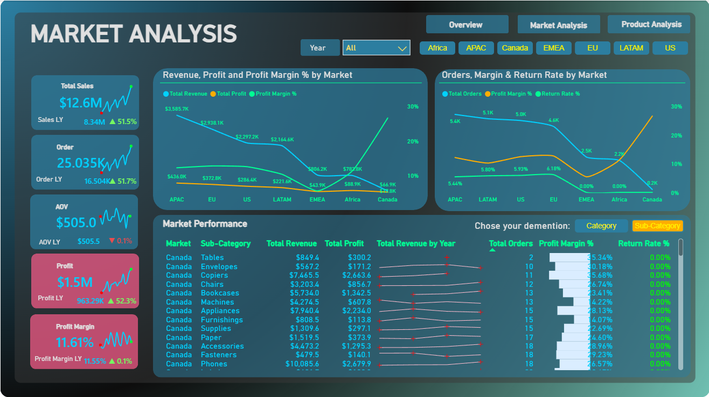
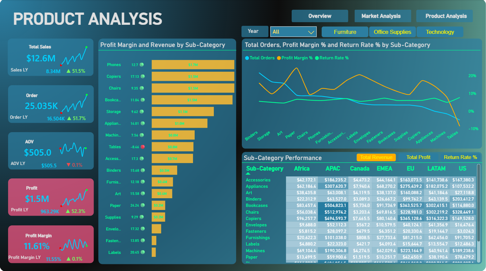

# 🌍 Global Superstore Sales Dashboard | Power BI



**Author:** Phan Minh Tan  
**Date:** May 2026  
**Tools Used:** Power BI, Power Query, DAX, CSV, Design Thinking

---

## 📌 Background & Overview

### 📖 What is this project about?

This project analyzes the **Global Superstore Sales** dataset of a multinational retail company operating across different markets and regions.  
The dashboard is designed to help senior managers understand business performance, compare markets, and identify strategic product groups for business growth.

The main goal is to answer three business questions:

- How is the company performing overall?
- Which markets or regions should the company focus on?
- Which product categories or sub-categories should be prioritized?

### 👤 Who is this project for?

- Senior Manager
- Sales Manager
- Business Manager
- Product Manager
- Data Analyst

### 🎯 Project Outcome

The final output is an interactive **Power BI dashboard** with three main pages:

- **Overview** – Monitor overall sales, profit, orders, customers, profit margin, and return performance.
- **Market Analysis** – Compare business performance across markets and regions.
- **Product Analysis** – Evaluate product categories and sub-categories by revenue, profit margin, orders, and return rate.

---

## 📂 Dataset Description & Data Structure

### 📌 Data Source

The dataset contains global sales transaction data from Superstore.

### 📊 Tables Used

The dataset includes three main tables:

| Table | Description |
|---|---|
| `Orders` | Contains transaction, customer, product, sales, quantity, and profit information. |
| `People` | Contains sales representative information by region. |
| `Returns` | Contains returned order information. |

### 🔗 Data Relationships

| From Table | To Table | Join Key | Relationship |
|---|---|---|---|
| `Orders` | `People` | `Region` | Many-to-One |
| `Orders` | `Returns` | `Order ID` | One-to-One / Left Join |

---

## 🧠 Design Thinking Process

Before building the dashboard, I used the Design Thinking process to understand stakeholder needs and define the dashboard direction.

### 1️⃣ Empathize - 5W1H



### 2️⃣ Empathize Map



### 3️⃣ Define Point of View



### 4️⃣ Northstar Metric



The chosen Northstar Metrics are:

- **Profit**
- **Profit Margin**

These metrics were selected because senior managers need to evaluate not only business growth, but also the quality and efficiency of that growth.

### 5️⃣ Ideate - Brainstorming



### 6️⃣ Ideate - Structure Idea



---

## 📊 Dashboard Preview

### I. Overview


The Overview page provides a high-level view of company performance, including sales, orders, customers, profit, profit margin, yearly trends, category performance, and return rate.

### II. Market Analysis



The Market Analysis page helps stakeholders compare revenue, profit, profit margin, orders, and return rate across different markets and regions.

### III. Product Analysis



The Product Analysis page focuses on product categories and sub-categories to identify high-profit products, low-margin items, and products with potential return issues.

---

## 📌 Key Insights

### 1. Overall Business Performance

- Sales and profit showed strong growth over time, while profit margin remained relatively stable.
- The dashboard helps stakeholders monitor whether business growth is driven by higher sales volume or better profitability.
- Return rate is included to help evaluate business quality, not only revenue performance.

### 2. Market Performance

- Some markets contribute strongly to revenue and profit, while others may require closer review due to weaker profitability or lower scale.
- Market-level analysis helps stakeholders identify where to expand, where to optimize operations, and where to monitor risk.
- The dashboard supports comparison by market, region, segment, and product category.

### 3. Product Performance

- Product analysis helps identify which categories and sub-categories generate strong revenue and profit.
- Profit margin and return rate provide additional context to avoid focusing only on high-sales products.
- The dashboard supports product strategy decisions by highlighting profitable products, low-margin items, and potential return-related issues.

---

## 🔎 Final Conclusion & Recommendation

| Area | Recommendation |
|---|---|
| Market Expansion | Focus on markets with strong profit contribution and healthy profit margin. Review markets with high sales but weaker margin before expanding further. |
| Product Strategy | Prioritize products and sub-categories that generate both high profit and strong profit margin. |
| Return Management | Monitor categories or regions with higher return rate to reduce profit leakage. |
| Business Monitoring | Use Profit and Profit Margin as key Northstar Metrics to evaluate sustainable business growth. |

---

## 🛠️ Skills Applied

- Data cleaning and transformation with Power Query
- Data modeling with relationships between Orders, People, and Returns
- DAX measure creation for sales, profit, orders, profit margin, return rate, and growth metrics
- Dashboard design and business storytelling in Power BI
- Stakeholder analysis using Design Thinking
- Market, product, and business performance analysis

---

## 📁 Repository Structure

```text
Global-Superstore-Sales-Dashboard/
│
├── dataset/
│   ├── Orders.csv
│   ├── People.csv
│   └── Returns.csv
│
├── image/
│   ├── 5w1h.png
│   ├── Map.png
│   ├── Define_POV_nsm.png
│   ├── pov.png
│   ├── brainstorming.png
│   ├── stucture_idea.png
│   ├── Overview.png
│   ├── MARKET_ANALYSIS.png
│   └── Product_Analysis.png
│
├── Global Superstore Sales Dashboard.pbix
└── README.md
```

---

## 🚀 How to Use

1. Download or clone this repository.
2. Open the `.pbix` file using Power BI Desktop.
3. Review the dashboard pages:
   - Overview
   - Market Analysis
   - Product Analysis
4. Use slicers and filters to explore performance by year, market, region, category, and sub-category.

---

## 📎 Project Link

> Add your Power BI Service link or GitHub repository link here.
